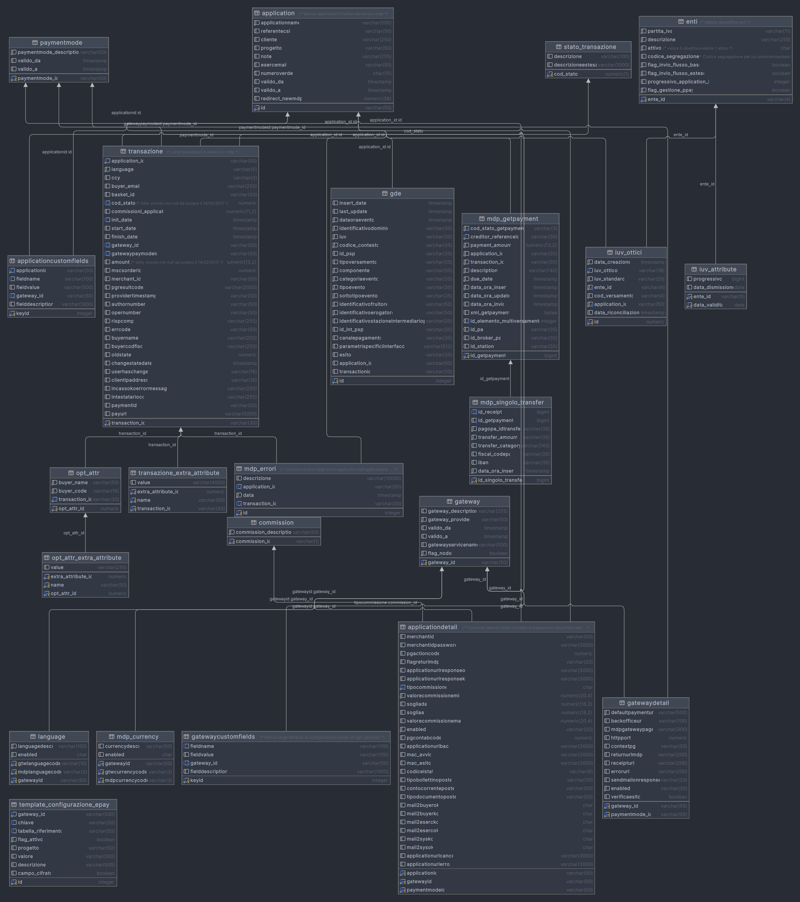
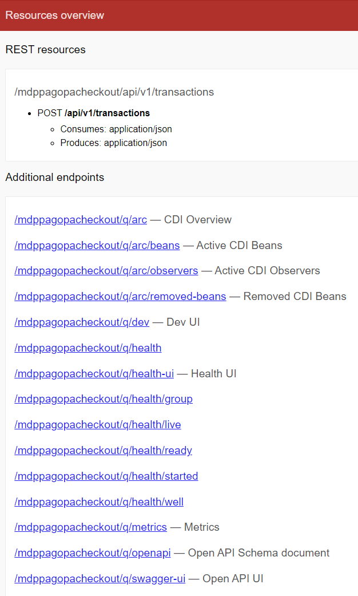

# mdppagopacheckout

Progetto basato su quarkus per modello unico

**ESEGUIRE SEMPRE GLI UNIT TEST PRIMA DI COMMITTARE!**

## Infos

+ java jdk11+ (openjdk is better)
+ ~~maven > 3.8.1~~
+ ~~quarkus 3.1.1 final~~ downgrade to quarkus 2.x, see branch ```quarkus_v3```
+ **use eng formatters!** [formatter_format_eclipse.xml](docs/formatter_format_eclipse.xml)! tabs!
+ **always edit the yaml**, not the generated classes! [mdppagopacheckout_v1.yaml](src/main/resources/mdppagopacheckout_v1.yaml)

## Health

+ http://localhost:8080/mdppagopacheckout/q/health
+ http://localhost:8080/mdppagopacheckout/q/health-ui

## CI/CD

Jenkis uses this command: ```clean package assembly:assembly -Dskip-unit-test=true```. Always double check if it
works! ```java -jar mdppagopacheckout-1.0-SNAPSHOT-runner.jar```

Always tag!

+ ```git for-each-ref --sort=creatordate --format '%(refname) %(creatordate)' refs/tags```

### Server

+ ts-qk1-be-mdpnew.site02.nivolapiemonte.it
+ ts-qk2-be-mdpnew.site02.nivolapiemonte.it
+ ts-qk%-be-mdpnew.site02.nivolapiemonte.it

### Apache

+ ts-ap1-be-mdpnew.site02.nivolapiemonte.it
+ ts-ap2-be-mdpnew.site02.nivolapiemonte.it
+ ts-ap%-be-mdpnew.site02.nivolapiemonte.it

### Build test

+ https://jenkins-cd.toolchain.csi.it/job/MDPNEW/job/RELEASE_TEST_GIT/job/MDPNEW_TST-INT-01/build?delay=0sec
+ occhio versione di prodotto, 13.0.0

## Todos

+ ~~alzare di versione quarkus~~

## Database's diagram



## swagger-ui

+ see flag in ```application.properties```
+ http://localhost:8080/mdppagopacheckout/q/swagger-ui

## Resources



## Links

+ https://engit.sharepoint.com/:w:/r/sites/CSI-Pagamenti/_layouts/15/Doc.aspx?sourcedoc=%7B96C7EBAB-02AC-4543-A883-92A32C1F5A6E%7D&file=PPAY-SRS-54-V03%20RDI54%20-%20Unico%20Modello%20di%20Pagamento_SOLUZIONE_REST.docx&action=default&mobileredirect=true
+ https://engit.sharepoint.com/:w:/r/sites/CSI-Pagamenti/_layouts/15/Doc.aspx?sourcedoc=%7B4FCB1379-92A2-4B99-BFBB-691A3DB0A3D0%7D&file=CDU-02-V01.2-mdppagopacheckout%20pagamento_OLD.docx&action=default&mobileredirect=true
+ https://github.com/pagopa/pagopa-api/blob/SANP3.4.1/openapi/checkout.yaml
